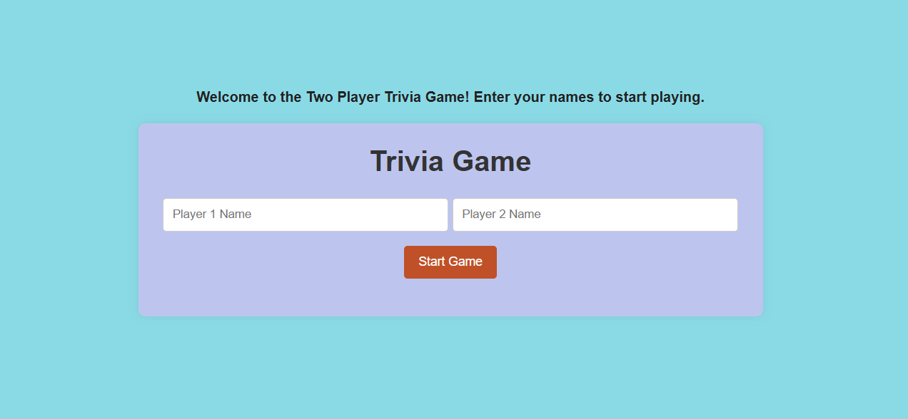
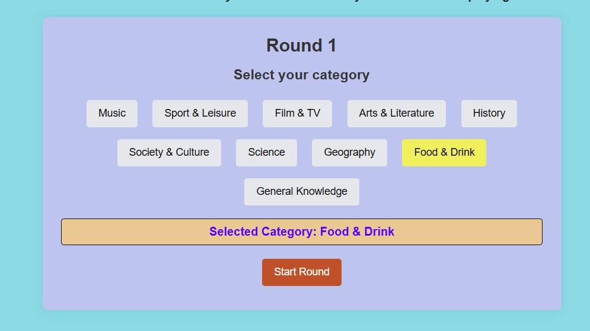
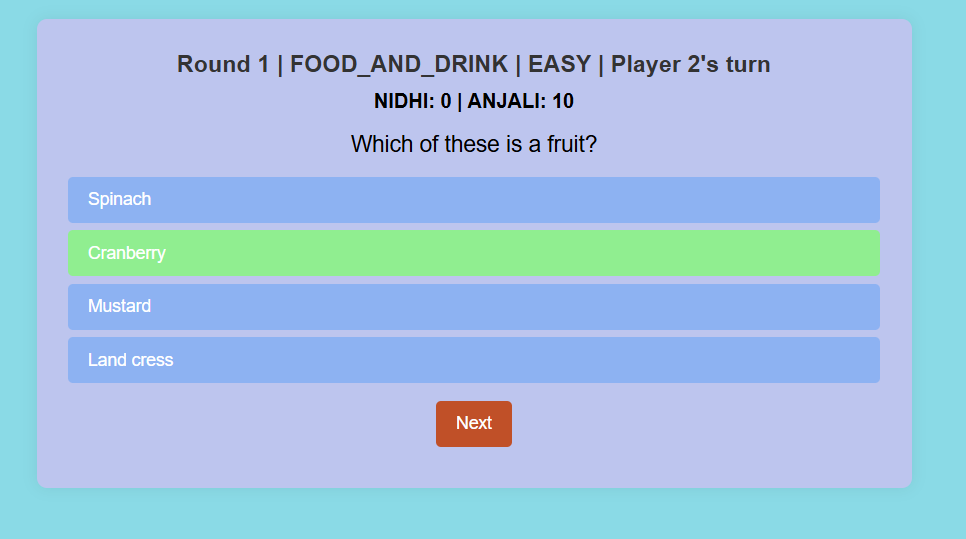
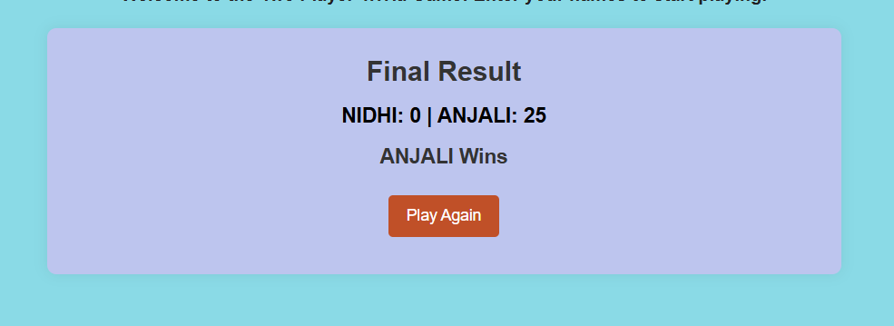

🎮 Trivia Battle Game

A two-player trivia quiz web application built using vanilla JavaScript, HTML, and CSS, where players compete across multiple rounds by selecting categories and answering dynamically fetched questions.

🔗 Live Demo: https://trivia-battle-quiz.netlify.app/

🔗 GitHub Repo: https://github.com/nidhikri/Trivia-Battle-Game

📌 Objective

The goal of this project is to build an interactive frontend application that:

Consumes a public REST API

Manages game state on the client side

Demonstrates strong understanding of JavaScript, DOM manipulation, and browser behavior

🧩 Features

Two-player gameplay with name input

Category selection for each round

Questions fetched dynamically from an external Trivia API

Multiple-choice questions with instant score updates

Round-based flow and final winner declaration

Responsive and clean UI

Fully client-side implementation (no frameworks, no localStorage)

🛠️ Tech Stack

HTML5 – Semantic structure

CSS3 – Layout and responsive styling

JavaScript (ES6+) – Game logic and state management

DOM APIs – Dynamic UI updates and interactions

REST API – Fetching trivia questions in real time

Netlify – Deployment with GitHub integration

🌐 API Used

The Trivia API
https://the-trivia-api.com/docs/

The application fetches questions based on selected categories and processes the response using JSON parsing and error handling.

🧠 How the Game Works (User Flow)

Players enter their names on the start screen

Each round begins with category selection

Questions are fetched from the API for the chosen category

Players answer questions one by one

Scores are updated dynamically

After all rounds, the final winner (or draw) is displayed

Users can restart the game and return to the main screen

📷 Screenshots (Live Demo)

🚀 Deployment

The project is deployed using Netlify with GitHub integration:

Automatic redeploy on every push

No backend or server configuration required

💡 What I Learned

Managing application state without frameworks

Working with browser DOM APIs effectively

Fetching and handling data from RESTful APIs

Structuring frontend code for readability and flow

Deploying static frontend applications

🙌 Acknowledgement

Trivia questions provided by The Trivia API.

📬 Contact

Nidhi Kumari
GitHub: https://github.com/nidhikri

LinkedIn: https://linkedin.com/in/nidhi-kumari3
